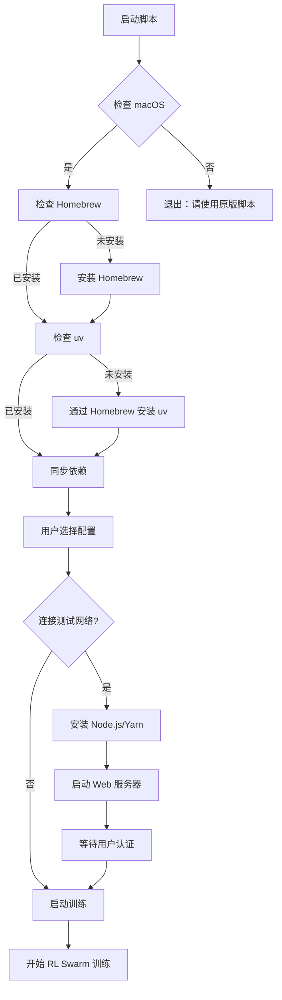

# RL Swarm Mac 使用指南

## 概述

`run_rl_swarm_mac.sh` 是专门为 macOS 系统优化的 RL Swarm 运行脚本，解决了原版脚本在 Mac 上的兼容性问题。

## 主要优化

### 1. 系统兼容性
- 🍎 **macOS 专用**：检测并确保只在 macOS 系统上运行
- 🏠 **Homebrew 集成**：自动安装和配置 Homebrew 包管理器
- 💻 **Apple Silicon 支持**：完美支持 M1/M2/M3/M4 芯片

### 2. 依赖管理优化
- **uv 安装**：通过 Homebrew 安装 uv，更稳定可靠
- **Node.js 管理**：优先使用 Homebrew 安装 Node.js
- **自动路径配置**：自动处理 Apple Silicon Mac 的路径问题

### 3. 性能优化
- **CPU 模式**：强制使用 CPU 模式（Mac 通常没有 NVIDIA GPU）
- **轻量模型**：默认使用 0.5B 参数模型，适合 Mac 性能
- **内存友好**：优化内存使用，避免系统卡顿

### 4. 用户体验改进
- **彩色输出**：增加黄色警告信息，提升可读性
- **错误诊断**：提供 Mac 特定的错误诊断信息
- **进度提示**：改进等待过程的用户反馈

## 使用方法

### 前置要求

1. **macOS 系统**（10.15+ 推荐）
2. **Xcode Command Line Tools**：
   ```bash
   xcode-select --install
   ```
3. **足够的磁盘空间**（至少 5GB）

### 运行步骤

1. **克隆项目**（如果还没有）：
   ```bash
   git clone https://github.com/gensyn-ai/rl-swarm.git
   cd rl-swarm
   ```

2. **运行 Mac 优化版脚本**：
   ```bash
   ./run_rl_swarm_mac.sh
   ```

3. **按提示操作**：
   - 选择是否连接到测试网络
   - 选择要加入的 Swarm（Math A 或 Math Hard B）
   - 如需连接测试网络，会自动打开浏览器进行认证

## 脚本工作流程



## 常见问题

### Q: 脚本在安装 Homebrew 时卡住
**A**: 这是正常的，Homebrew 安装可能需要几分钟时间。请耐心等待，确保网络连接正常。

### Q: uv sync 失败
**A**: 尝试以下解决方案：
1. 确保有足够的磁盘空间
2. 检查网络连接
3. 重新运行脚本，会自动创建新的虚拟环境

### Q: Node.js 安装失败
**A**: 确保 Homebrew 正常工作：
```bash
brew doctor
```

### Q: 内存不足或系统卡顿
**A**: 
- 关闭其他大型应用程序
- 脚本已优化为使用 0.5B 模型，如仍有问题请考虑增加内存
- 使用活动监视器检查内存使用情况

### Q: 网络连接问题
**A**: 
- 确保能访问 GitHub 和 Hugging Face
- 如在中国大陆，可能需要配置网络代理
- 检查防火墙设置

## 技术细节

### 依赖管理
- **Python**: 通过 uv 管理，支持虚拟环境
- **Node.js**: 通过 Homebrew 安装 LTS 版本
- **系统工具**: 自动检测和安装必要工具

### 配置文件
- **模型配置**: `hivemind_exp/configs/mac/grpo-qwen-2.5-0.5b-deepseek-r1.yaml`
- **游戏模式**: 固定为 `gsm8k`（数学问题求解）
- **CPU 模式**: 强制启用，适合 Mac 环境

### 日志文件
- **Yarn 日志**: `logs/yarn.log`
- **Python 日志**: 控制台输出

## 性能建议

### 硬件要求
- **RAM**: 8GB 最低，16GB 推荐
- **CPU**: Apple Silicon 推荐，Intel 芯片也支持
- **存储**: SSD 推荐，确保足够空间

### 优化设置
- **关闭不必要的应用程序**
- **确保 Mac 电源连接**（避免性能降频）
- **监控温度**，避免过热

## 支持与反馈

如遇到问题，请：
1. 检查 `logs/` 目录下的日志文件
2. 确认满足前置要求
3. 尝试重新运行脚本
4. 在 GitHub 上提交 Issue

---

**注意**: 此脚本专为 macOS 优化，Linux/Windows 用户请使用原版 `run_rl_swarm_uv.sh`。 