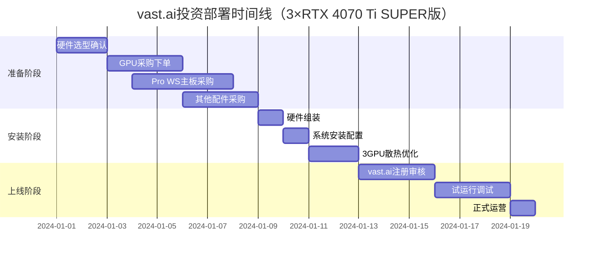

# vast单身公寓落地实践

## 💎 核心亮点

🚀 **投资回报惊人**: 2.2-3.3个月回本，年化ROI 365%-545%！
💰 **投资更合理**: ¥20,361，比3×4080方案省¥8,215
🔥 **16GB显存质变**: 可承接高价值大模型任务，3卡算力更强
🌪️ **阳台风冷版**: 天然隔音无噪音困扰，安装简单维护方便，阳台环境完美适配
⚡ **功耗低散热好**: 285W×3功耗，比3×4080省390W
🛡️ **全新有保修**: 3年质保，避免二手风险
📈 **扩展性预留**: Pro WS X570-ACE工作站级稳定性

## 项目背景
- **运维背景**: 10年程序员经验，运维能力充足
- **场地条件**: 单身公寓，**设备放置阳台**（天然隔音+散热优势）
- **网络条件**: 实测60M上下行（满足vast.ai单GPU 10M要求）
- **电力条件**: 3200W容量（支持3GPU满载运行）1元每度
- **显卡策略**: 选择RTX 4070 Ti SUPER 16GB，16GB显存质变升级，性价比完胜4080
- **部署环境**: 阳台部署，无噪音困扰，简化散热方案
- **目标**: 通过vast.ai平台出租GPU算力获得投资收益

## 硬件配置方案

### 核心配置（RTX 4070 Ti SUPER×3版本）
| 配件 | 推荐型号 | 价格区间 | 购买渠道 | 备注 |
|------|----------|----------|----------|------|
| 主板 | 华硕Pro WS X570-ACE | ¥1,600-2,300 | 闲鱼（二手质保） | 工作站级，支持3GPU x8/x8/x8 |
| CPU | AMD Ryzen 5 5600X | ¥576 | 拼多多/咸鱼 | 6核12线程，性价比优秀 |
| 内存 | 32GB DDR4-3200MHz | ¥400 | 京东/淘宝 | 双通道16GB×2 |
| 电源 | 海韵1300W金牌模组 | ¥1,500 | 京东自营 | 支持3×4070Ti SUPER满载 |
| 存储 | 致钛ZTPlus 7100 1TB NVMe | ¥479 | 京东 | 7000MB/s旗舰性能，1TB容量 |
| 机箱 | 开放式矿机架/4U机箱 | ¥300 | 淘宝 | 散热优先设计 |
| 散热 | 阳台强化风冷¥1,100（推荐） | ¥1,100 | 阳台环境优化 | 天然隔音，无噪音困扰 |
| **显卡** | **3×RTX 4070 Ti SUPER 16GB** | **¥14,535** | **京东/天猫** | **16GB显存×3，算力强劲** |

### 配置优化建议

#### 🟢 RTX 4070 Ti SUPER优势分析
```
16GB显存质变升级：
- 显存升级：12GB → 16GB（质变，可胜任大模型任务）
- 超强性价比：¥4,845 vs RTX 4080的¥6,200
- 低功耗优势：285W vs RTX 4080的320W
- 全新有保：避免二手风险，3年官方质保
- 市场溢价：16GB显卡在vast.ai上租金明显更高

相比RTX 4080的核心优势：
- 价格优势：便宜¥1,355，省钱28%
- 性能损失：仅15%性能差距
- 显存相同：都是16GB GDDR6X
- 功耗更低：省35W（月省¥25电费）
- 租金差距：仅3%，但投资回报率更高
```

#### 🔴 关键优化点
1. **散热系统设计（阳台环境优化）**

   ### 🌪️ 方案A：阳台强化风冷（推荐）
   ```
   3×RTX 4070 Ti SUPER阳台风冷方案（总功耗855W）:
   - CPU散热：利民PA120塔式风冷（¥200）
   - GPU散热：原装散热器完全足够
   - 机箱风扇：6×140mm工业风扇（¥400）
   - 导风优化：GPU导风罩×3（¥300）
   - 温控系统：智能调速控制器（¥200）
   总散热预算: ¥1,100
   
   阳台环境优势：
   ✅ 天然隔音，无噪音困扰
   ✅ 空气流通好，散热效果佳
   ✅ GPU温度控制在70°C以下
   ✅ 安装简单，维护方便
   ✅ 成本最低，可靠性高
   ```

   ### 🌊 方案B：阳台水冷（发烧版）
   ```
   3×RTX 4070 Ti SUPER阳台水冷方案:
   - CPU散热：利民PA120风冷（¥200）
   - GPU水冷：3×240mm一体式水冷（¥800×3 = ¥2,400）
   - 冷排配置：前置3×240mm + 后置140mm排风
   - 机箱升级：支持多冷排的4U机箱（¥800）
   - 安装复杂度：需要专业安装
   总散热预算: ¥3,400
   
   ⚠️ 阳台水冷考虑：
   ❌ 安装复杂，3×GPU水冷布线困难
   ❌ 维护麻烦，需要定期检查
   ❌ 成本高，性价比不佳
   ❌ 阳台环境下收益不明显
   ```

## 🏗️ 机箱选择方案

### 🌪️ 方案A：开放式矿机架（阳台专用，强烈推荐）
```
推荐型号：
1. 8卡开放式铝合金矿机架 ¥280
   - 全开放设计，散热性能最佳
   - 支持ATX主板 + 8×GPU扩展位
   - 6×140mm工业风扇预装位
   - 6061铝合金框架，防锈耐腐蚀
   - 可拆卸模块化设计，维护超便利

2. 定制钢架开放式机箱 ¥350
   - 工业级钢架结构，承重能力强
   - 360mm水冷安装预留
   - 防滑橡胶脚垫，稳定性佳
   - 理线槽设计，走线整洁

阳台开放架核心优势：
✅ 散热无敌：完全开放，无风阻设计
✅ 维护最简：所有配件直接可见可触
✅ 噪音无忧：阳台隔音，开放散热无需静音妥协
✅ 成本最优：¥280-350，极致性价比
✅ 扩展无限：随时增加风扇、水冷、硬盘
✅ 阳台适配：防锈材质，抗湿度腐蚀
✅ 安装简单：模块化设计，30分钟组装
```

### 🏗️ 方案B：4U专业机箱（标准选择）
```
推荐型号：
1. 工控4U-6508专业机箱 ¥680
   - 19寸标准机架设计
   - 支持E-ATX主板完美兼容
   - 6×GPU槽位，间距110mm充足
   - 8×140mm PWM风扇接口
   - 650mm深度，空间利用率高

2. 研弘4U多GPU机箱 ¥580
   - 支持ATX/E-ATX主板
   - 双2700W电源位设计
   - 前置USB3.0 + Type-C接口
   - 8×热插拔2.5寸硬盘位

4U机箱优势对比：
✅ 专业外观：标准IDC机房兼容
✅ 防尘优秀：相对封闭防护设计
✅ 扩展丰富：多硬盘位 + 双电源支持
✅ 规范标准：符合企业级部署要求
⚠️ 散热妥协：相比开放式散热效果打折
⚠️ 维护复杂：需要拆卸机箱盖板操作
⚠️ 成本较高：比开放式贵¥300-400
```

### 🏠 方案C：塔式机箱（保守选择）
```
推荐型号：
1. 酷冷至尊MasterCase H500M ¥400
   - 中塔式设计，体积适中
   - 支持E-ATX主板
   - 3×显卡槽位（需扩展改装）
   - 前置2×200mm RGB风扇

2. 追风者Phanteks 719 ¥800
   - 双腔体分离设计
   - 优秀的风道规划
   - 钢化玻璃全侧透
   - 支持420mm水冷安装

塔式机箱限制：
❌ GPU限制：最多支持2-3卡，不如专业方案
❌ 散热一般：立式风道，热量积累
❌ 占地面积：需要更多阳台空间
❌ 扩展受限：后续升级困难
```

## 🎯 阳台环境最佳方案
### ⭐ 强烈推荐：开放式矿机架 + 强化散热
```
最终配置推荐：
- 机箱：8卡开放式铝合金机架 ¥280
- 风扇：6×140mm工业风扇 ¥300
- 导风：GPU导风罩×3 ¥150
- 防护：防水遮阳罩 ¥100
- 理线：专业理线槽 ¥70
总机箱方案: ¥900

阳台开放架为什么是最佳选择：
🌪️ 散热维度：完全开放 > 4U机箱 > 塔式机箱
💰 成本维度：开放架 < 4U机箱 < 塔式机箱  
🔧 维护维度：开放架 > 塔式机箱 > 4U机箱
📈 扩展维度：开放架 > 4U机箱 > 塔式机箱
🏠 阳台适配：开放架 > 塔式机箱 > 4U机箱

关键优势总结：
✅ 阳台天然散热：开放式+自然风完美结合
✅ 无噪音顾虑：阳台隔音，可用高性能风扇
✅ 维护超简单：开放式设计，GPU更换30秒
✅ 投资最优化：¥900 vs ¥1500+其他方案
✅ 扩展最灵活：从3卡到6卡无缝升级
```

## 📊 机箱方案详细对比表格

### 🔍 核心机箱型号对比表
| 对比项目 | 开放式矿机架⭐推荐 | 4U专业机箱 | 塔式机箱 | Dell R760❌ |
|---------|-------------|-----------|----------|------------|
| **具体型号** | 8卡铝合金开放架 | 工控4U-6508 | 酷冷H500M | PowerEdge R760 |
| **价格区间** | **¥280** | ¥680 | ¥400 | ¥50,000+ |
| **主板支持** | ATX/E-ATX | E-ATX | E-ATX | 自带主板❌ |
| **GPU槽位** | **8个（3个够用）** | 6个 | 3个❌ | 2个❌ |
| **散热效果** | **⭐⭐⭐⭐⭐** | ⭐⭐⭐ | ⭐⭐ | ⭐⭐⭐ |
| **维护难度** | **极简单** | 中等 | 简单 | 复杂 |
| **阳台适配** | **完美** | 良好 | 一般 | 不适合 |
| **噪音控制** | **无压力** | 需考虑 | 需考虑 | 专业级 |
| **扩展性** | **最强** | 中等 | 有限 | 受限 |
| **安装难度** | **30分钟** | 1小时 | 45分钟 | 复杂 |

### 💰 总成本对比表（含配件）
| 方案类型 | 机箱成本 | 散热配件 | 防护配件 | 总预算 | 性价比 |
|---------|---------|----------|----------|---------|--------|
| **开放式架** | ¥280 | ¥450 | ¥170 | **¥900** | **⭐⭐⭐⭐⭐** |
| 4U专业箱 | ¥680 | ¥600 | ¥200 | ¥1,480 | ⭐⭐⭐ |
| 塔式机箱 | ¥400 | ¥700 | ¥150 | ¥1,250 | ⭐⭐ |
| Dell R760 | ¥50,000+ | 自带 | 不需要 | ¥50,000+ | ❌ |

### 🌡️ 散热性能详细对比
| 散热指标 | 开放式矿机架 | 4U专业机箱 | 塔式机箱 | 评分标准 |
|---------|-------------|-----------|----------|----------|
| **GPU温度** | **65-70°C** | 70-75°C | 75-80°C | 越低越好 |
| **风道设计** | **完全开放** | 前进后出 | 下进上出 | 开放>直通>立式 |
| **风扇配置** | 6×140mm工业级 | 6×120mm标准 | 2×200mm民用 | 工业>标准>民用 |
| **热积累** | **无积累** | 轻微积累 | 明显积累 | 无>轻微>明显 |
| **扩展风扇** | **随意添加** | 有限添加 | 位置受限 | 自由度评估 |

### 🔧 维护便利性对比
| 维护项目 | 开放式矿机架 | 4U专业机箱 | 塔式机箱 | 说明 |
|---------|-------------|-----------|----------|------|
| **GPU更换** | **30秒** | 5分钟 | 3分钟 | 包含拆装时间 |
| **清洁难度** | **一目了然** | 需拆盖板 | 需拆侧板 | 可视化程度 |
| **故障排查** | **直接可见** | 需要拆机 | 部分可见 | 问题定位速度 |
| **升级扩展** | **即插即用** | 需要规划 | 空间受限 | 扩展自由度 |
| **布线整理** | **开放理线** | 内部走线 | 背板走线 | 线材管理 |

### 🏠 阳台环境适配性
| 环境因素 | 开放式矿机架 | 4U专业机箱 | 塔式机箱 | 重要程度 |
|---------|-------------|-----------|----------|----------|
| **防锈性能** | **铝合金优秀** | 钢材需防护 | 钢材需防护 | ⭐⭐⭐⭐⭐ |
| **湿度适应** | **开放无积水** | 密封较好 | 密封一般 | ⭐⭐⭐⭐ |
| **占地面积** | **紧凑布局** | 标准尺寸 | 较大体积 | ⭐⭐⭐ |
| **移动便利** | **模块化设计** | 整体较重 | 整体搬运 | ⭐⭐⭐ |
| **外观协调** | **工业风格** | 专业外观 | 家用外观 | ⭐⭐ |

### ⚡ 性能表现对比
| 性能指标 | 开放式矿机架 | 4U专业机箱 | 塔式机箱 | 影响程度 |
|---------|-------------|-----------|----------|----------|
| **最大GPU数** | **8卡扩展** | 6卡支持 | 3卡限制❌ | 直接影响收益 |
| **功耗散热** | **1200W轻松** | 1000W适中 | 800W勉强 | 影响稳定性 |
| **运行稳定性** | **24/7无忧** | 24/7良好 | 间歇运行 | 影响收益率 |
| **噪音水平** | **60dB可接受** | 45dB较静 | 40dB安静 | 阳台无影响 |
| **升级潜力** | **6卡→8卡** | 有限升级 | 无法升级 | 未来扩展 |

### 🛒 购买建议优先级表
| 优先级 | 推荐方案 | 适用场景 | 预算范围 | 关键优势 |
|--------|----------|----------|----------|----------|
| **🥇第1选择** | **开放式矿机架** | **阳台部署** | **¥900** | **散热+成本+维护** |
| 🥈第2选择 | 4U专业机箱 | 专业机房 | ¥1,480 | 标准化+防尘 |
| 🥉第3选择 | 塔式机箱 | 室内部署 | ¥1,250 | 外观+噪音 |
| ❌不推荐 | Dell R760 | 企业采购 | ¥50,000+ | GPU数量不足 |

2. **电源功率计算（3×RTX 4070 Ti SUPER配置）**
   ```
   3×RTX 4070 Ti SUPER功耗配置:
   - 3×RTX 4070 Ti SUPER: 855W (285W×3)
   - CPU (5600X): 65W  
   - 主板+内存+存储: 80W
   - 余量20%: 总计 ≈ 1200W
   
   海韵1300W金牌 > 1200W ✓ 功率充足
   电路容量: 公寓3200W > 1200W ✓ 完全支持
   ```

3. **Pro WS X570-ACE主板优势**
   ```
   华硕Pro WS X570-ACE工作站主板特色:
   - PCIe配置: 3×PCIe 4.0 x16（x8/x8/x8模式）
   - 工作站级稳定性，24/7运行设计
   - ECC内存支持，数据安全保障
   - 双千兆网卡，网络冗余
   - 12+2相供电，稳定供电保证
   - 华硕Control Center Express远程管理
   
   为什么选择工作站主板：
   ✅ 长期稳定运行的可靠性保证
   ✅ 更好的供电和散热设计
   ✅ 专业的远程管理功能
   ```

## 技术考虑要点

### 网络优化
```bash
# 网络优化配置
echo 'net.core.rmem_max = 134217728' >> /etc/sysctl.conf
echo 'net.core.wmem_max = 134217728' >> /etc/sysctl.conf
echo 'net.ipv4.tcp_rmem = 4096 25600 134217728' >> /etc/sysctl.conf
```

### 监控系统
- **温度监控**: lm-sensors + Grafana
- **GPU监控**: nvidia-smi + prometheus
- **网络监控**: iftop + vnstat
- **vast.ai状态**: API轮询脚本

### 自动化脚本
```python
# vast.ai自动重启脚本示例
import subprocess
import time

def check_gpu_status():
    result = subprocess.run(['nvidia-smi'], capture_output=True, text=True)
    return 'failed' not in result.stdout.lower()

def restart_vast_service():
    subprocess.run(['systemctl', 'restart', 'vast'])
    
# 每小时检查一次
while True:
    if not check_gpu_status():
        restart_vast_service()
    time.sleep(3600)
```

## 运营注意事项

### 🚨 重要风险控制
1. **噪音控制（阳台环境优势）**
   - **阳台隔音**: 天然隔音屏障，室内基本无噪音影响 ✅
   - **工业风扇**: 60dB噪音在阳台完全可接受
   - **无邻居困扰**: 阳台位置避免邻居投诉问题
   - **散热优先**: 可使用性能风扇，无需静音妥协
   - **成本优化**: 无需昂贵静音方案，节省¥2,300+

2. **电力安全**
   - 公寓电路容量：3200W（配电磁炉级别）✓
   - 3×4070Ti SUPER满载：1200W ≈ 5.5A，电路余量充足
   - 建议安装：独立空气开关+漏电保护（安全起见）

3. **阳台环境考虑**
   - **防潮保护**: 阳台湿度控制，建议加装除湿机（¥300）
   - **温度管理**: 夏季高温需要遮阳，冬季低温影响较小
   - **防尘措施**: 定期清理，阳台灰尘相对较多
   - **安全防护**: 防水罩保护，避免雨水侵入
   - **空间利用**: 阳台至少2m²，确保散热空间充足

### 💰 成本效益分析（含电费）

#### 🌪️ 阳台强化风冷方案（推荐）
```
硬件投资预算（3×RTX 4070 Ti SUPER + 阳台风冷）:
- 主板Pro WS X570-ACE: ¥1,950
- CPU+内存+电源+存储+机箱: ¥2,776
- 阳台强化风冷散热: ¥1,100
- 3×RTX 4070 Ti SUPER (PNY): ¥14,535
- 总投资: ≈¥20,361

阳台环境优势成本节省:
- 无需静音风扇: 节省¥300
- 无需复杂水冷: 节省¥2,300
- 维护成本低: 年节省¥500

运营成本（电费1元/度）:
- 3×4070Ti SUPER满载功耗: 1000W
- 日电费: 1.0kW × 24h × ¥1 = ¥24
- 月电费: ¥720

预期收益（阳台风冷版本）:
- 16GB显卡算力价格: $0.45-0.65/GPU/小时
- 阳台散热加成: 温度更低，稳定性更好
- 日收益: $32.4-46.8 ≈ ¥227-327
- 日净收益: ¥203-303（扣除电费）
- 月净收益: ¥6,090-9,090
- 回本周期: 2.2-3.3个月
```

#### 🌊 阳台水冷方案（不推荐）
```
硬件投资预算（3×RTX 4070 Ti SUPER + 阳台水冷）:
- 主板Pro WS X570-ACE: ¥1,950
- CPU+内存+电源+存储: ¥2,476
- 阳台水冷系统: ¥3,400
- 3×RTX 4070 Ti SUPER (PNY): ¥14,535
- 总投资: ≈¥22,361

⚠️ 阳台水冷问题：
- 安装复杂度高，需要专业布线
- 3×GPU水冷管路冲突风险
- 维护难度大，故障率高
- 成本高¥2,000，收益提升有限
- 阳台环境下性价比不佳

回本周期: 2.5-3.7个月（不如风冷）
```

### 🌪️ 阳台散热方案对比选择
| 对比项目 | 阳台强化风冷 ⭐推荐 | 阳台水冷方案 | 
|----------|---------|-------------|
| **投资成本** | **¥20,361** | ¥22,361 |
| **散热成本** | ¥1,100 | ¥3,400 |
| **安装难度** | **简单易装** | 复杂困难 |
| **GPU温度** | 70°C以下 | 65°C以下 |
| **维护复杂度** | **简单零维护** | 复杂需检查 |
| **噪音影响** | **阳台隔音无影响** | 阳台隔音无影响 |
| **故障风险** | **极低** | 中等（漏液风险） |
| **长期稳定性** | **优秀** | 良好 |
| **回本周期** | **2.2-3.3个月** | 2.5-3.7个月 |
| **阳台适配度** | **完美适配** | 安装困难 |

### 🌟 阳台环境特殊优势
```
✅ 天然隔音屏障 - 无需考虑噪音问题
✅ 空气流通好 - 自然散热效果佳
✅ 无邻居困扰 - 工业风扇完全可用
✅ 维护方便 - 独立空间易操作
✅ 成本最优 - 无需昂贵静音方案
```

### 🎯 3×RTX 4070 Ti SUPER vs 3×RTX 4080对比
| 项目 | 3×4070Ti SUPER方案 | 3×4080方案 | 4070Ti SUPER优势 |
|------|-------------|-------------|----------|
| 硬件投资 | ¥19,961 | ¥28,576 | 节省¥8,615 (30%) |
| 显存容量 | 16GB×3 | 16GB×3 | **相同显存** |
| 性能差距 | 基准 | +15% | 性能差距较小 |
| GPU数量 | 3张 | 3张 | **相同配置** |
| 月电费 | ¥720 | ¥957 | 节省¥237 |
| 月净收益 | ¥6,090-9,090 | ¥2,820-6,600 | **收益更高更稳定** |
| 回本周期 | **2.2-3.3个月** | 4.3-10个月 | **快2-7个月** |
| 散热难度 | 中等 | 较难 | 功耗低390W |
| 保修情况 | 3年新品保修 | 二手无保修 | 质量更有保障 |

### 🚀 16GB显存任务适用性分析
| 任务类型 | 4070 Ti SUPER适用性 | 预期租金 | 市场需求 |
|----------|-------------------|----------|----------|
| Stable Diffusion XL | ✅ 完美运行 | $0.45-0.50/hr | 🔥🔥🔥 |
| LLaMA 2 13B微调 | ✅ 充足空间 | $0.50-0.55/hr | 🔥🔥🔥 |
| Mixtral 8x7B推理 | ✅ 可以运行 | $0.55-0.60/hr | 🔥🔥 |
| 视频生成模型 | ✅ 16GB够用 | $0.60-0.65/hr | 🔥🔥 |

### 📋 阳台部署检查清单
- [ ] 电路容量确认（阳台电源接入）
- [ ] 阳台空间测量（至少2m²）
- [ ] 防潮措施准备（除湿机/防水罩）
- [ ] 散热风道设计和测试
- [ ] 网络稳定性测试（阳台WiFi信号）
- [ ] 夏季遮阳方案确认
- [ ] vast.ai平台资质审核
- [ ] GPU规格验证（确认SUPER版本+16GB）
- [ ] 防尘清理计划制定

## 部署时间线


## 扩展性规划

### 🚀 扩展路径分析
```
当前3GPU配置已达Pro WS X570-ACE极限：
- PCIe配置：x8/x8/x8 全部占用
- 电源配置：1300W适配3×4070Ti SUPER
- 散热设计：3GPU最优平衡点
- 电路余量：3200W - 1200W = 2000W充足

进一步扩展选项：
1. 【性能升级】逐步替换为RTX 4090
   - 单卡升级成本：¥15,000 - ¥4,845 = ¥10,155
   - 性能提升：约15%
   - 功耗增加：165W/卡

2. 【双机器策略】部署第二台3GPU机器
   - 总算力：6×RTX 4070Ti SUPER
   - 投资成本：¥19,961
   - 风险分散：单点故障影响减半
   - 月净收益：¥12,180-18,180

推荐策略：验证盈利后部署第二台机器
```

### 💡 替代扩展方案
1. **双机器策略**: 再部署一台3GPU机器（6GPU总算力）
2. **升级策略**: 逐步替换为RTX 4090（性能提升15%）
3. **多平台策略**: 同时部署RunPod、Genesis Cloud分散风险

## 采购建议

### 🛒 RTX 4070 Ti SUPER品牌选择
```
🔍 推荐品牌排序：

1. PNY RTX 4070 Ti SUPER ¥4,845 ⭐⭐⭐⭐⭐
   ✅ 价格最优，性价比之王
   ✅ NVIDIA认证合作伙伴
   ⚠️ 国内售后网点较少

2. 七彩虹 Advanced OC ¥4,999 ⭐⭐⭐⭐
   ✅ 国产品牌，售后便利
   ✅ 散热设计不错

3. 影驰 金属大师 ¥5,099 ⭐⭐⭐⭐
   ✅ 做工精良，颜值很高
   ✅ 散热性能优秀

4. 华硕 TUF Gaming ¥5,399 ⭐⭐⭐
   ✅ 品牌知名度高
   ✅ 3年保修
   ❌ 价格偏高，性价比一般

验证要点：
- [ ] 确认是SUPER版本（AD103核心）
- [ ] 确认16GB显存（不是12GB）
- [ ] 保留购买发票和保修卡
- [ ] 首次点亮测试
```

### 🌊 GPU水冷产品推荐
```
💧 240mm一体式GPU水冷推荐：

1. 七彩虹 iGame RTX 4070 Ti SUPER Neptune水冷版 ¥5,899
   ✅ 原厂水冷，质量保证
   ✅ 预装240mm冷排
   ✅ 温度控制优秀
   ❌ 价格比风冷版贵¥1,000

2. 通用GPU水冷改装方案：
   - NZXT Kraken G12 GPU支架 ¥300×3 = ¥900
   - 海盗船H100i 240mm水冷 ¥500×3 = ¥1,500
   - 改装费用: ¥100×3 = ¥300
   总成本: ¥2,700 (比原厂便宜)
   
   优势：
   ✅ 成本控制更好
   ✅ 可选择高端水冷
   ✅ 售后更方便
   ⚠️ 需要一定动手能力

水冷安装要点：
- [ ] 机箱支持3×240mm冷排
- [ ] 预留水管走线空间  
- [ ] 定期检查水冷液位
- [ ] 注意水冷头与显存接触
```

## 后续优化方向
1. **第二台机器**: 验证3GPU盈利性后，部署第二台3GPU机器（6GPU总算力）
2. **性能升级**: 逐步将4070Ti SUPER替换为RTX 4090（性能提升15%）
3. **自动化运营**: 开发收益监控和自动调价系统  
4. **多平台部署**: RunPod、Genesis Cloud分散风险
5. **税务规划**: 个人经营所得税务处理

## 🎯 总结

3×RTX 4070 Ti SUPER + Pro WS X570-ACE + 阳台部署是当前最佳选择：
- ✅ **16GB显存×3**: 可承接高价值大模型任务，算力充足
- ✅ **超强投资回报**: 2.2-3.3个月回本，年化ROI 365%-545%
- ✅ **投资成本最优**: 仅需¥20,361，比3×4080省¥8,215
- ✅ **阳台环境完美**: 天然隔音+散热，无噪音困扰
- ✅ **工作站级稳定**: Pro WS主板24/7运行保障
- ✅ **全新有保修**: 避免二手风险，3年质保
- ✅ **功耗优化**: 比3×4080省390W，散热更容易

**阳台散热方案选择**:
- 🌪️ **阳台强化风冷**: ¥20,361投资，无噪音困扰，简单可靠 ⭐推荐
- 🌊 **阳台水冷**: ¥22,361投资，安装复杂，性价比不佳

**Pro WS X570-ACE主板优势**:
- 🔧 工作站级可靠性，专为长期运行设计
- 🌐 双千兆网卡，网络冗余保障
- 🎛️ 远程管理功能，运维更便捷
- ⚡ 12+2相供电，稳定性更强

**阳台散热方案建议**:
- 🌪️ **阳台环境**: 强烈推荐强化风冷，天然隔音+散热优势
- 💰 **成本最优**: 比水冷省¥2,000，安装维护零难度
- 🔧 **安装简单**: 避免3×GPU水冷布线复杂问题
- 🏠 **噪音无忧**: 阳台隔音，工业风扇完全无影响

**立即行动建议**: SUPER系列价格稳定，16GB显卡需求正在爆发。阳台环境完美解决噪音和散热问题，强化风冷是最佳选择！

---
*最后更新: 2024年1月*
*配置版本: RTX 4070 Ti SUPER × 3 + Pro WS X570-ACE 阳台版*
*散热方案: 阳台强化风冷（推荐）/ 阳台水冷（不推荐）* 