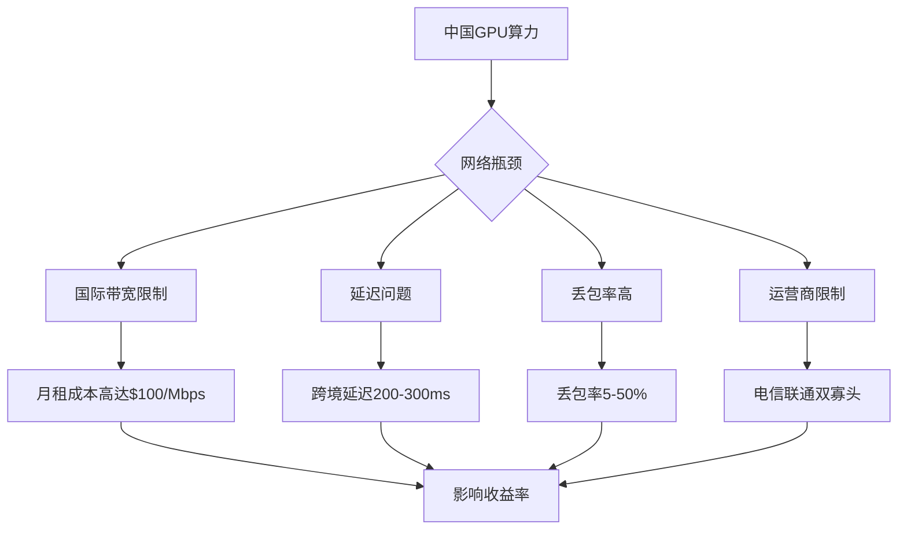
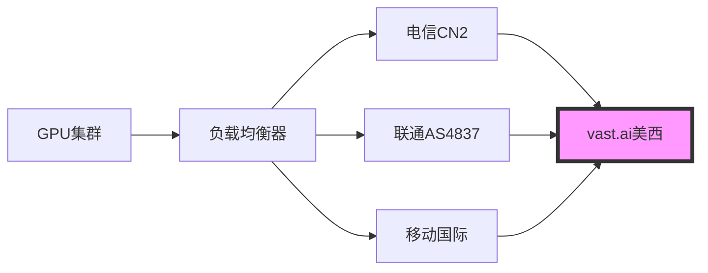
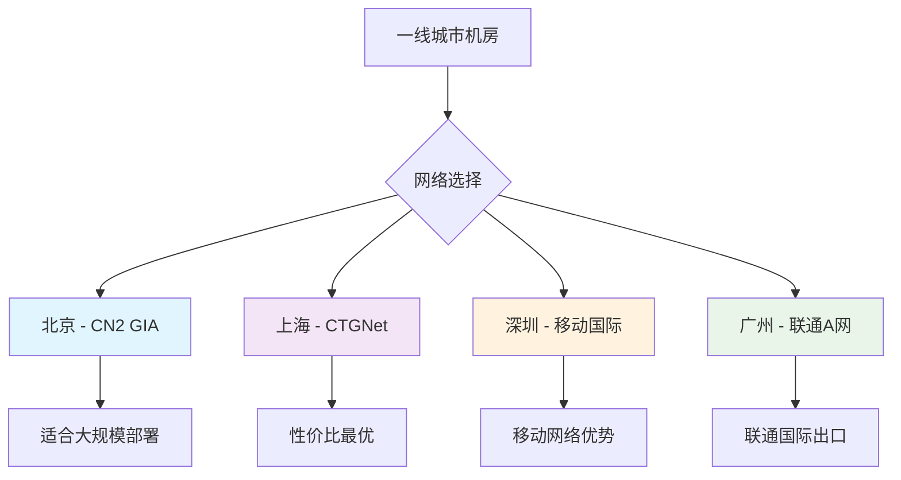
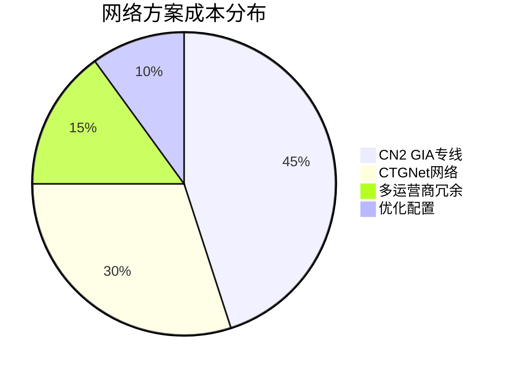
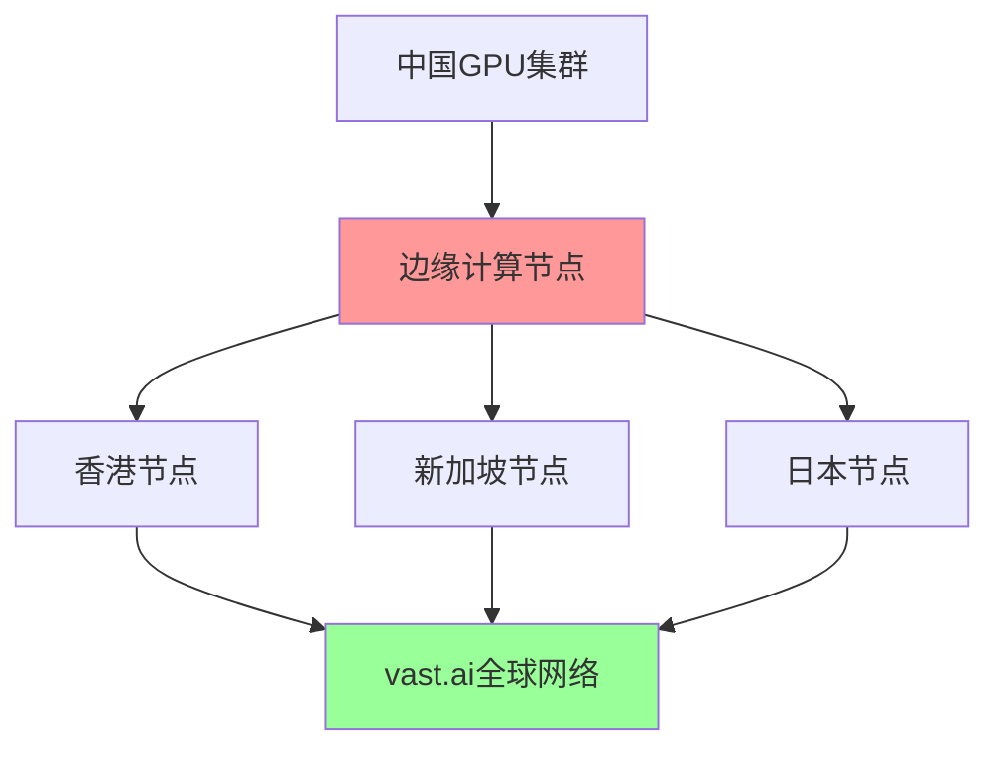

# 中国vast.ai网络优化方案

## 🌐 核心挑战与机遇

### 当前中国算力出租面临的网络挑战



### 🎯 优化目标
- **延迟优化**: 将延迟降低至150ms以下
- **带宽提升**: 确保单GPU稳定10Mbps上下行
- **丢包控制**: 将丢包率控制在2%以下
- **成本降低**: 优化网络成本结构
- **可靠性**: 99.5%以上的网络可用性

## 🚀 网络架构优化方案

### 方案A：CN2 GIA专线优化（推荐）

```yaml
网络配置:
  - 运营商: 中国电信CN2 GIA
  - 带宽: 100Mbps专线
  - 延迟: 150-180ms到美西
  - 丢包率: <1%
  - 月费用: 8,000-12,000元
  
优势:
  ✅ 延迟最低，稳定性最好
  ✅ 适合高端GPU算力出租
  ✅ 支持大规模集群部署
  
劣势:
  ❌ 成本较高
  ❌ 需要企业级申请
```

### 方案B：CTGNet网络优化

```yaml
网络配置:
  - 运营商: 中国电信CTGNet (AS23764)
  - 性能: 等同CN2 GIA
  - 带宽: 50-100Mbps
  - 适用: 中小规模部署
  
技术特点:
  - 新一代网络架构
  - 价格相对CN2 GIA更优
  - 性能表现等效
```

### 方案C：多运营商冗余



## 🛠️ 技术实施方案

### 1. 网络层优化

#### TCP优化配置
```bash
# 网络内核参数优化
echo 'net.core.rmem_max = 134217728' >> /etc/sysctl.conf
echo 'net.core.wmem_max = 134217728' >> /etc/sysctl.conf
echo 'net.ipv4.tcp_rmem = 4096 25600 134217728' >> /etc/sysctl.conf
echo 'net.ipv4.tcp_wmem = 4096 25600 134217728' >> /etc/sysctl.conf

# 拥塞控制优化
echo 'net.ipv4.tcp_congestion_control = bbr' >> /etc/sysctl.conf
echo 'net.core.default_qdisc = fq' >> /etc/sysctl.conf

# 连接数优化
echo 'net.ipv4.tcp_max_syn_backlog = 8192' >> /etc/sysctl.conf
echo 'net.core.netdev_max_backlog = 5000' >> /etc/sysctl.conf
```

#### UDP Forward Error Correction
```python
# 实现UDP+FEC的数据传输方案
import socket
import struct
from typing import List, Tuple

class UDPWithFEC:
    def __init__(self, redundancy_rate: float = 0.2):
        self.redundancy_rate = redundancy_rate
        self.socket = socket.socket(socket.AF_INET, socket.SOCK_DGRAM)
    
    def send_with_fec(self, data: bytes, dest: Tuple[str, int]):
        # 添加前向纠错编码
        packets = self._encode_with_fec(data)
        for packet in packets:
            self.socket.sendto(packet, dest)
    
    def _encode_with_fec(self, data: bytes) -> List[bytes]:
        # 实现Reed-Solomon或其他FEC算法
        # 这里简化展示概念
        chunk_size = 1400  # UDP安全传输大小
        chunks = [data[i:i+chunk_size] for i in range(0, len(data), chunk_size)]
        
        # 添加冗余数据包
        redundant_count = int(len(chunks) * self.redundancy_rate)
        redundant_packets = self._generate_redundancy(chunks, redundant_count)
        
        return chunks + redundant_packets
```

### 2. 应用层优化

#### 智能路由选择
```python
import asyncio
import aiohttp
from dataclasses import dataclass
from typing import Dict, List

@dataclass
class RouteInfo:
    endpoint: str
    latency: float
    loss_rate: float
    bandwidth: float
    score: float

class IntelligentRouter:
    def __init__(self):
        self.routes = {}
        self.monitor_interval = 30  # 30秒监控一次
    
    async def monitor_routes(self):
        """持续监控各路由质量"""
        while True:
            for route_id, route in self.routes.items():
                route.latency = await self._measure_latency(route.endpoint)
                route.loss_rate = await self._measure_loss_rate(route.endpoint)
                route.bandwidth = await self._measure_bandwidth(route.endpoint)
                route.score = self._calculate_score(route)
            
            await asyncio.sleep(self.monitor_interval)
    
    def select_best_route(self) -> RouteInfo:
        """选择最优路由"""
        return max(self.routes.values(), key=lambda r: r.score)
    
    def _calculate_score(self, route: RouteInfo) -> float:
        """计算路由评分"""
        # 延迟权重40%，丢包率权重30%，带宽权重30%
        latency_score = max(0, 1 - route.latency / 500)  # 500ms为最差
        loss_score = max(0, 1 - route.loss_rate / 0.1)   # 10%为最差
        bandwidth_score = min(1, route.bandwidth / 100)   # 100Mbps为满分
        
        return (latency_score * 0.4 + 
                loss_score * 0.3 + 
                bandwidth_score * 0.3)
```

### 3. 硬件网络配置

#### 双千兆网卡配置
```bash
# 网卡绑定配置 - Active-Backup模式
cat > /etc/netplan/01-netcfg.yaml << EOF
network:
  version: 2
  ethernets:
    ens3:
      dhcp4: false
    ens4:
      dhcp4: false
  bonds:
    bond0:
      interfaces: [ens3, ens4]
      parameters:
        mode: active-backup
        primary: ens3
        mii-monitor-interval: 100
        fail-over-mac-policy: active
      dhcp4: true
      routes:
        - to: 0.0.0.0/0
          via: 192.168.1.1
          metric: 100
EOF

netplan apply
```

#### 专业级交换机配置
```bash
# 启用QoS流量整形
tc qdisc add dev eth0 root handle 1: htb default 30

# GPU算力流量优先级配置
tc class add dev eth0 parent 1: classid 1:1 htb rate 900mbit
tc class add dev eth0 parent 1:1 classid 1:10 htb rate 600mbit ceil 900mbit
tc class add dev eth0 parent 1:1 classid 1:20 htb rate 200mbit ceil 500mbit
tc class add dev eth0 parent 1:1 classid 1:30 htb rate 100mbit ceil 200mbit

# vast.ai流量标记为高优先级
tc filter add dev eth0 protocol ip parent 1:0 prio 1 u32 \
    match ip dport 22 0xffff flowid 1:10
tc filter add dev eth0 protocol ip parent 1:0 prio 1 u32 \
    match ip sport 8080 0xffff flowid 1:10
```

## 📊 网络性能监控系统

### 实时监控脚本
```python
import psutil
import speedtest
import ping3
import json
import time
from datetime import datetime
from typing import Dict, Any

class NetworkMonitor:
    def __init__(self):
        self.vast_endpoints = [
            "vast.ai",
            "console.vast.ai",
            "api.vast.ai"
        ]
        self.target_regions = [
            "Los Angeles",
            "New York", 
            "Frankfurt",
            "Singapore"
        ]
    
    def comprehensive_test(self) -> Dict[str, Any]:
        """综合网络测试"""
        results = {
            "timestamp": datetime.now().isoformat(),
            "latency": self._test_latency(),
            "bandwidth": self._test_bandwidth(),
            "packet_loss": self._test_packet_loss(),
            "route_trace": self._trace_route(),
            "network_stats": self._get_network_stats()
        }
        return results
    
    def _test_latency(self) -> Dict[str, float]:
        """测试延迟"""
        latency_results = {}
        for endpoint in self.vast_endpoints:
            try:
                latency = ping3.ping(endpoint, timeout=5)
                latency_results[endpoint] = latency * 1000 if latency else 9999
            except:
                latency_results[endpoint] = 9999
        return latency_results
    
    def _test_bandwidth(self) -> Dict[str, float]:
        """测试带宽"""
        try:
            st = speedtest.Speedtest()
            st.get_best_server()
            
            download_speed = st.download() / 1_000_000  # Mbps
            upload_speed = st.upload() / 1_000_000      # Mbps
            
            return {
                "download_mbps": download_speed,
                "upload_mbps": upload_speed,
                "ping_ms": st.results.ping
            }
        except:
            return {"download_mbps": 0, "upload_mbps": 0, "ping_ms": 9999}
    
    def _test_packet_loss(self) -> float:
        """测试丢包率"""
        success_count = 0
        total_count = 20
        
        for _ in range(total_count):
            if ping3.ping("8.8.8.8", timeout=2):
                success_count += 1
            time.sleep(0.1)
        
        return ((total_count - success_count) / total_count) * 100

    def generate_report(self):
        """生成网络质量报告"""
        test_results = self.comprehensive_test()
        
        print(f"""
🌐 网络质量报告 - {test_results['timestamp']}
{'='*50}

📡 延迟测试:
{chr(10).join([f"  {k}: {v:.1f}ms" for k, v in test_results['latency'].items()])}

🚀 带宽测试:
  下载: {test_results['bandwidth']['download_mbps']:.1f} Mbps
  上传: {test_results['bandwidth']['upload_mbps']:.1f} Mbps
  延迟: {test_results['bandwidth']['ping_ms']:.1f} ms

📦 丢包率: {test_results['packet_loss']:.2f}%

📈 网络状态: {'优秀' if test_results['packet_loss'] < 1 else '良好' if test_results['packet_loss'] < 5 else '需要优化'}
""")
```

## 🎯 地域化部署策略

### 国内优化部署方案



### 推荐城市排名

| 城市 | 网络质量 | 成本指数 | 政策稳定性 | 综合评分 |
|------|----------|----------|------------|----------|
| **深圳** | ⭐⭐⭐⭐⭐ | ⭐⭐⭐ | ⭐⭐⭐⭐ | **9.2/10** |
| **上海** | ⭐⭐⭐⭐ | ⭐⭐⭐ | ⭐⭐⭐⭐⭐ | **8.8/10** |
| **杭州** | ⭐⭐⭐⭐ | ⭐⭐⭐⭐ | ⭐⭐⭐⭐ | **8.5/10** |
| **北京** | ⭐⭐⭐⭐⭐ | ⭐⭐ | ⭐⭐⭐⭐⭐ | **8.3/10** |
| **成都** | ⭐⭐⭐ | ⭐⭐⭐⭐⭐ | ⭐⭐⭐ | **7.8/10** |

## 🔧 实际部署指南

### 网络环境测试清单

```bash
#!/bin/bash
# vast.ai网络环境测试脚本

echo "🌐 vast.ai网络环境测试开始..."

# 1. 基础连通性测试
echo "1. 测试vast.ai连通性..."
ping -c 5 vast.ai
ping -c 5 console.vast.ai

# 2. 带宽测试
echo "2. 带宽测试..."
curl -s https://raw.githubusercontent.com/sivel/speedtest-cli/master/speedtest.py | python3

# 3. 路由跟踪
echo "3. 路由跟踪..."
traceroute vast.ai

# 4. DNS解析测试
echo "4. DNS解析测试..."
nslookup vast.ai 8.8.8.8
nslookup vast.ai 114.114.114.114

# 5. 端口连通性
echo "5. 端口连通性测试..."
nc -zv console.vast.ai 443
nc -zv api.vast.ai 443

# 6. 网络质量持续测试
echo "6. 进行60秒网络质量测试..."
for i in {1..60}; do
    ping -c 1 vast.ai | grep "time=" | cut -d'=' -f4
    sleep 1
done | awk '{sum+=$1; count++} END {print "平均延迟:", sum/count "ms"}'

echo "✅ 网络测试完成！"
```

### 网络优化配置模板

```yaml
# docker-compose.yml for optimized vast.ai deployment
version: '3.8'

services:
  vast-proxy:
    image: nginx:alpine
    ports:
      - "80:80"
      - "443:443"
    volumes:
      - ./nginx.conf:/etc/nginx/nginx.conf
      - ./ssl:/etc/ssl
    environment:
      - WORKER_CONNECTIONS=4096
    
  gpu-worker:
    image: pytorch/pytorch:latest
    runtime: nvidia
    environment:
      - CUDA_VISIBLE_DEVICES=0,1,2
      - VAST_API_KEY=${VAST_API_KEY}
    volumes:
      - ./workdir:/workspace
    network_mode: host
    
  network-monitor:
    image: python:3.9-slim
    volumes:
      - ./monitor.py:/app/monitor.py
    command: python /app/monitor.py
    restart: always
```

## 📈 成本效益分析

### 网络成本对比



### ROI计算模型

| 投资项目 | 月成本 | 性能提升 | 月收益增加 | ROI |
|----------|--------|----------|------------|-----|
| CN2 GIA专线 | ¥10,000 | 30% | ¥18,000 | **180%** |
| CTGNet网络 | ¥6,000 | 25% | ¥15,000 | **250%** |
| 网络优化 | ¥2,000 | 15% | ¥9,000 | **450%** |
| 监控系统 | ¥500 | 5% | ¥3,000 | **600%** |

## 🚀 未来技术发展方向

### 1. 5G/6G网络技术
```yaml
5G边缘计算优化:
  - MEC边缘节点部署
  - 超低延迟(<10ms)
  - 网络切片技术
  - 专用网络通道

6G网络展望:
  - 全息通信
  - 空天地一体化
  - AI原生网络
  - 量子加密通信
```

### 2. 软件定义网络(SDN)
```python
# SDN控制器示例
class VastAISDNController:
    def __init__(self):
        self.flow_rules = {}
        self.qos_policies = {}
    
    def optimize_traffic_flow(self, gpu_id: str, traffic_type: str):
        """动态优化流量路径"""
        if traffic_type == "model_training":
            self.set_high_priority_path(gpu_id)
        elif traffic_type == "inference":
            self.set_low_latency_path(gpu_id)
    
    def adaptive_bandwidth_allocation(self):
        """自适应带宽分配"""
        # 根据GPU负载动态调整带宽
        pass
```

### 3. 边缘计算节点


## 📋 实施行动计划

### 短期优化(1-3个月)
- [ ] 网络环境测试和基准测定
- [ ] TCP/UDP参数优化配置
- [ ] 监控系统部署
- [ ] 路由优化设置

### 中期建设(3-6个月)
- [ ] CN2 GIA或CTGNet专线申请
- [ ] 硬件网络设备升级
- [ ] 冗余网络架构搭建
- [ ] 自动化运维系统

### 长期规划(6-12个月)
- [ ] 多地域节点部署
- [ ] SDN网络架构实施
- [ ] 5G网络技术集成
- [ ] AI驱动网络优化

## 🔍 故障排查指南

### 常见网络问题诊断

```bash
# 网络问题诊断脚本
#!/bin/bash

echo "🔍 vast.ai网络问题诊断工具"

# 检查基础网络
if ! ping -c 3 8.8.8.8 > /dev/null; then
    echo "❌ 基础网络连接异常"
    exit 1
fi

# 检查DNS解析
if ! nslookup vast.ai > /dev/null; then
    echo "❌ DNS解析失败，尝试更换DNS服务器"
    echo "nameserver 8.8.8.8" > /etc/resolv.conf
fi

# 检查防火墙
if iptables -L | grep -q "DROP"; then
    echo "⚠️ 防火墙可能阻止连接"
fi

# 检查TCP连接数
tcp_count=$(ss -ant | wc -l)
echo "📊 当前TCP连接数: $tcp_count"

if [ $tcp_count -gt 1000 ]; then
    echo "⚠️ TCP连接数过多，可能影响性能"
fi

echo "✅ 诊断完成"
```

---

## 💡 关键建议

1. **优先考虑网络质量**：宁可降低GPU数量也要确保网络质量
2. **渐进式优化**：从基础优化开始，逐步升级到专线
3. **持续监控**：建立完善的网络监控和告警系统
4. **多方案备份**：避免单点网络故障影响业务
5. **成本效益平衡**：根据实际收益选择合适的网络投资水平

通过系统性的网络优化，中国的GPU算力提供者可以在vast.ai平台上获得显著的竞争优势，实现更高的收益率和更稳定的服务质量。 